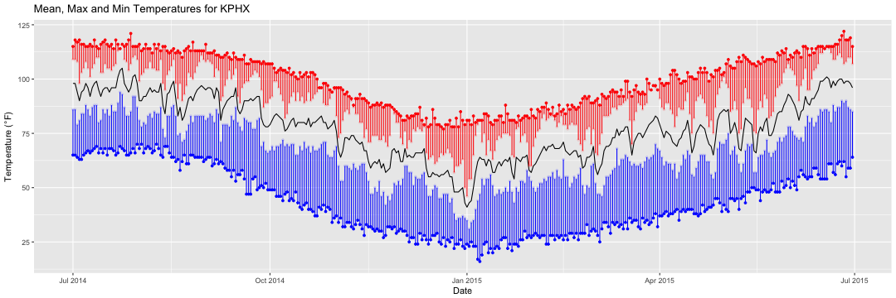

Weather Data by Airport
========================================================
author: Jonathan Kunze
date: March 26, 2017
autosize: true

Developing Data Products 

Course Project

Data
========================================================

In July of 2015, the data journalism blog FiveThirtyEight posted an article entitled ['What 12 Months of Record-Setting Temperatures Looks Like Across the U.S.'](https://fivethirtyeight.com/features/what-12-months-of-record-setting-temperatures-looks-like-across-the-u-s/) The data used for this article was [posted on GitHub](https://github.com/fivethirtyeight/data/tree/master/us-weather-history) in their data repository and made publically available.

The interesting thing about this dataset was that it contained daily mean, high and low temperatures for a number of US cities (split by airport), along with record high and low temperatures for each day.

Analysis
========================================================

The purpose of this project was to make this data visually accessible using a simple  interactive drop-down. The user can select a city (by airport) to view the difference between daily high and low temperatures and record high and low temperatures.

Large differences between high and record high or low and record low show relatively moderate weather. Record-setting days are indicated by no line between a high/record high or low/record low. Mean temperature is drawn as a line for reference.

The application uses the Shiny framework, with a ui.R file generating the reactive HTML page and a server.R file performing calculations and generating the output.

Client/Server Interaction
========================================================
On the server side, a subset calculaiton is performed using the airport selected by the user on the weather data and a plot is produced. The plot is then returned to output$tempPlot to be shown in the UI.


```r
# Define server logic required to draw the temperature data plots
shinyServer(function(input, output) {
  output$tempPlot <- renderPlot({
    # Use the airport dropdown input to subset the data and compute the graph
    wx_sub <- wx[airport==input$airport]
    g <- ggplot(wx_sub, aes(x=date))
    # Omitted for brevity. Evaluated output on next page.
    return(g)
```

Example Output: Phoenix (KPHX)
========================================================


